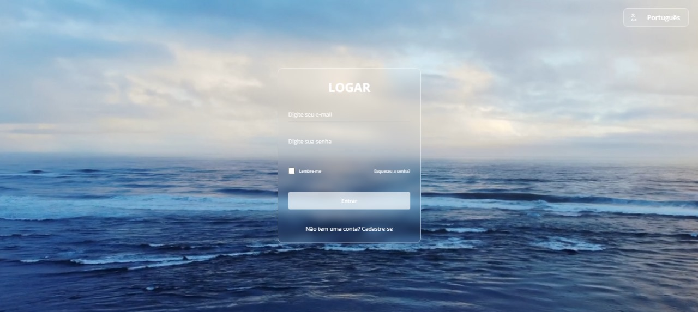
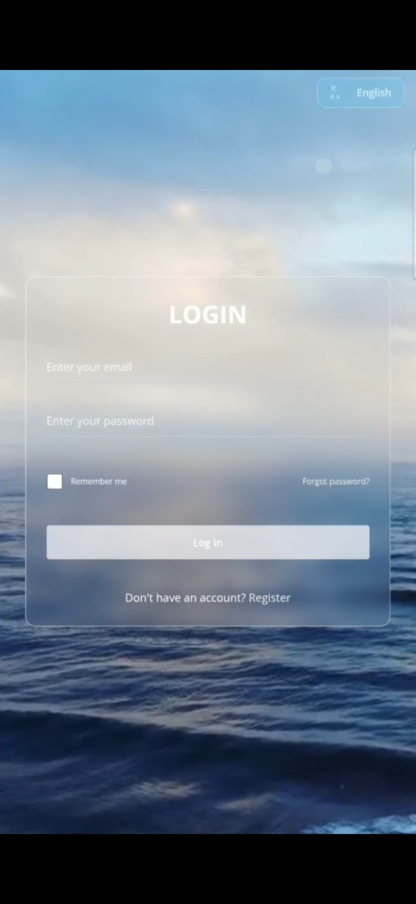

# 📄 Documentação do Projeto - Tela de Login com Seletor de Idiomas e Vídeo de Fundo

## 🧩 Tecnologias Utilizadas

- **HTML5** – Estrutura da interface
- **CSS3** – Estilização, responsividade e efeitos
- **JavaScript Vanilla** – Lógica de tradução e animação
- **Google Fonts (Open Sans)** – Tipografia
- **Vídeo em loop como plano de fundo**
- **Acessibilidade com ARIA attributes**

---

## 🎯 Funcionalidades

- 💬 **Seletor de idiomas** (Português, Inglês, Espanhol)
- 🔐 **Formulário de login** com campos de e-mail e senha
- 🌐 **Tradução dinâmica do conteúdo** via JavaScript
- 📱 **Layout responsivo** para desktop e mobile
- 🎥 **Vídeo de fundo animado** com efeito de movimento ao passar o mouse ou ao tocar na tela

---

## 📽️ Demonstração

Veja o projeto em funcionamento clicando no link abaixo:

🔗 [Acessar demonstração ao vivo](https://emersonromana.github.io/glassmorphism-Full-Screen-Background-Video/)

---

## 🌍 Estrutura de Idiomas (`translations`)

```js
const translations = {
  pt: {
    loginTitle: "Login",
    emailLabel: "Digite seu e-mail",
    passwordLabel: "Digite sua senha",
    rememberMe: "Lembre-me",
    forgotPassword: "Esqueceu a senha?",
    loginButton: "Entrar",
    noAccount: "Não tem uma conta?",
    registerLink: "Cadastre-se"
  },
  en: {
    loginTitle: "Login",
    emailLabel: "Enter your email",
    passwordLabel: "Enter your password",
    rememberMe: "Remember me",
    forgotPassword: "Forgot password?",
    loginButton: "Log In",
    noAccount: "Don't have an account?",
    registerLink: "Register"
  },
  es: {
    loginTitle: "Iniciar sesión",
    emailLabel: "Ingresa tu correo",
    passwordLabel: "Ingresa tu contraseña",
    rememberMe: "Recuérdame",
    forgotPassword: "¿Olvidaste tu contraseña?",
    loginButton: "Ingresar",
    noAccount: "¿No tienes una cuenta?",
    registerLink: "Regístrate"
  }
};  
```


🧠 Função de Tradução
```js

function setLanguage(lang) {
  document.querySelectorAll("[data-i18n]").forEach(el => {
    const key = el.getAttribute("data-i18n");
    if (translations[lang] && translations[lang][key]) {
      el.textContent = translations[lang][key];
    }
  });
}
```

🖼️ Estrutura HTML
📌 Seletor de Idioma
```html
<div id="language-selector" class="custom-dropdown">
  <svg class="language-icon" ...>...</svg>
  <div class="dropdown-selected" id="dropdown-selected">PT</div>
  <ul class="dropdown-options" id="dropdown-options">
    <li data-lang="pt"><span class="abbr">PT</span><span class="full">Português</span></li>
    <li data-lang="en"><span class="abbr">EN</span><span class="full">English</span></li>
    <li data-lang="es"><span class="abbr">ES</span><span class="full">Español</span></li>
  </ul>
</div>
```
🔐 Formulário de Login
```html

<div class="wrapper" id="loginBox">
  <form action="#">
    <h2 data-i18n="loginTitle">Login</h2>
    <div class="input-field">
      <input type="text" required id="email" />
      <label data-i18n="emailLabel">Digite seu e-mail</label>
    </div>
    <div class="input-field">
      <input type="password" required id="password" />
      <label data-i18n="passwordLabel">Digite sua senha</label>
    </div>
    <div class="forget">
      <label><input type="checkbox" id="remember" /> <p data-i18n="rememberMe">Lembre-me</p></label>
      <a href="#" data-i18n="forgotPassword">Esqueceu a senha?</a>
    </div>
    <button type="submit" data-i18n="loginButton">Entrar</button>
    <div class="register">
      <p><span data-i18n="noAccount">Não tem uma conta?</span> <a href="#" data-i18n="registerLink">Cadastre-se</a></p>
    </div>
  </form>
</div>
```
📱 Responsividade
Tela pequena (Mobile):
Botão de idioma com apenas as abreviações (PT, EN, ES)

Formulário centralizado e ajustado em largura

O seletor de idioma é ocultado em telas muito pequenas (<480px && <540px de altura)

```css

@media (max-width: 480px), (max-height: 540px) {
  #language-selector {
    display: none;
  }
}
```

🌌 Animação de Fundo (efeito do vídeo)
```js

box.addEventListener("mouseleave", (e) => {
  // move o vídeo para criar um efeito de profundidade
});

box.addEventListener("mouseenter", () => {
  video.style.transform = "translate(-50%, -50%)";
});
```
📷 Capturas de Tela






📁 Organização Sugerida de Pastas
bash
Copiar código
/project
├── index.html
├── style.css
├── script.js
├── /image
│   └── fundo.mp4
